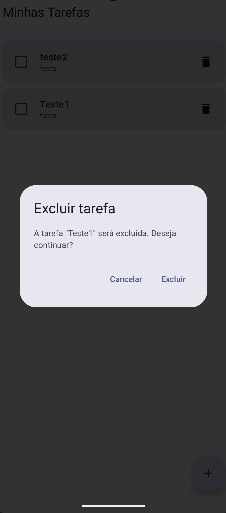
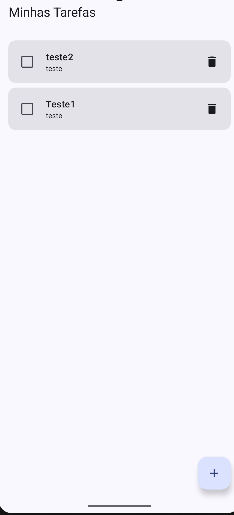
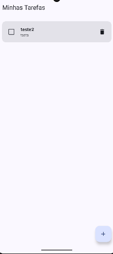

# Evidências — Confirmação de exclusão de tarefas

## 1. Lista antes da exclusão

## 2. Diálogo aberto com a tarefa selecionada

## 3. Resultado ao cancelar

## 4. Nova abertura do diálogo

## 5. Resultado após confirmar a exclusão
